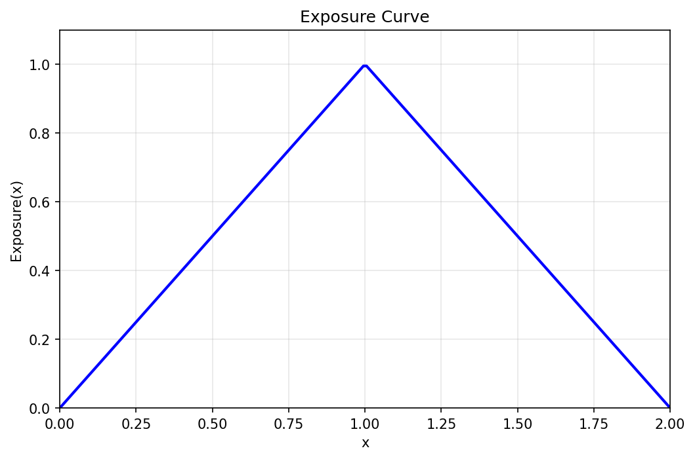
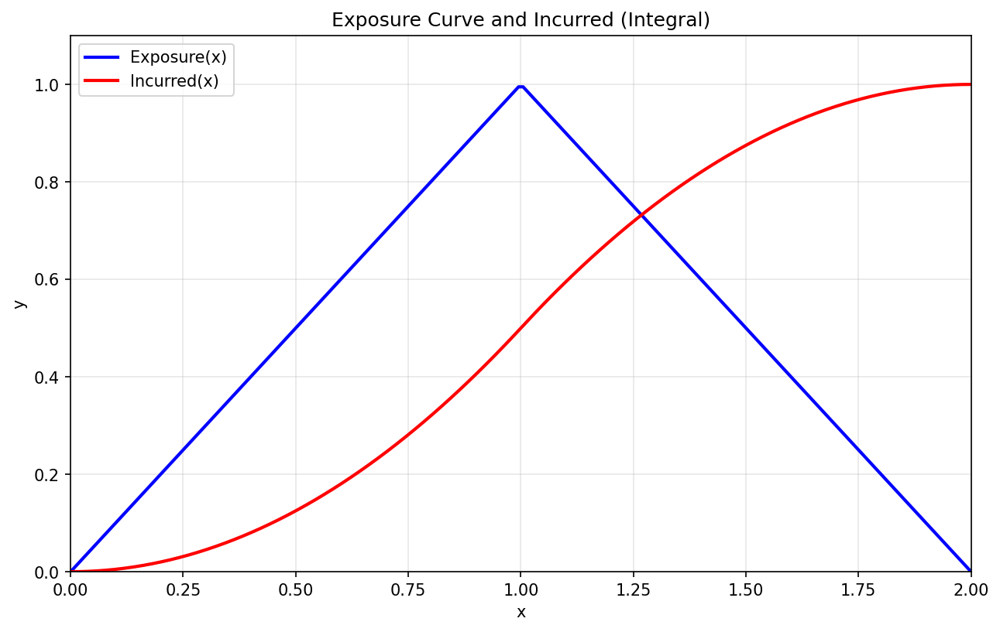
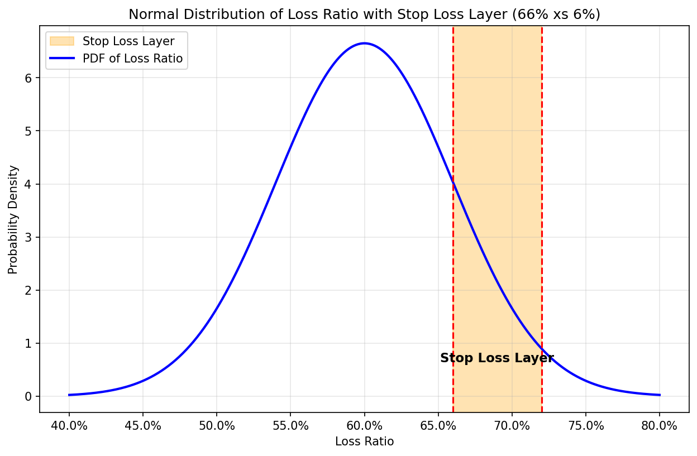
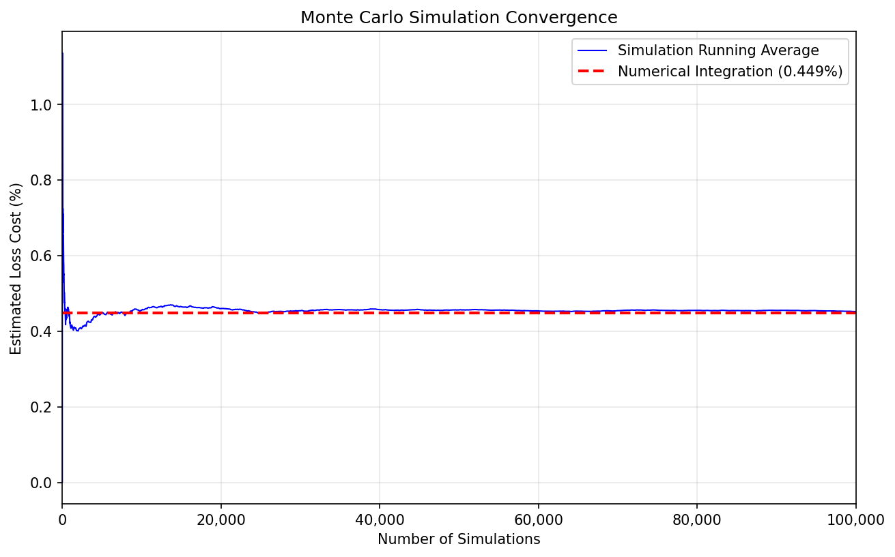

# Actuarial Quiz Questions

A Jupyter notebook demonstrating actuarial concepts through two quiz questions covering exposure curves and stop loss pricing.

## Setup

```bash
python3 -m venv .venv
source .venv/bin/activate
pip install jupyter numpy scipy matplotlib
jupyter notebook actuarial_quiz.ipynb
```

---

## Q1: Integral of Year of Account Exposure

This models a **year of account** with:
- **Even attachment** of policies throughout the year
- **One-year policy terms**

At time x=0 (start of year), no exposure has been earned. Exposure builds linearly as policies attach throughout the first year, peaking at x=1 (end of year 1) when all policies are on-risk. During year 2, policies begin to expire, and exposure decreases linearly until x=2 when all policies have run off.

The Year of Account Exposure is defined as:
- For 0 ≤ x ≤ 1: Exposure(x) = x
- For 1 < x ≤ 2: Exposure(x) = 1 - (x - 1) = 2 - x

### Step 1: Plot the Year of Account Exposure

A triangular exposure peaking at x = 1.



### Step 2: Integrate Exposure(x) to get Incurred(x)

Incurred(x) = ∫₀ˣ Exposure(t) dt

| x | Incurred(x) |
|---|-------------|
| 0 | 0.0000 |
| 1 | 0.5000 |
| 2 | 1.0000 |

### Step 3: Plot Year of Account Exposure and Incurred Together

Combined line chart showing both the YOA Exposure and its cumulative integral.



---

## Q2: Stop Loss at Sigma Excess of Mean Plus Sigma

Normal distribution with:
- Mean (μ) = 60%
- Standard deviation (σ) = 6%

**Layer:** 66% xs 6% (attachment at μ + σ, width of σ)

### PDF Visualization

The probability density function is plotted with:
- Vertical lines at 66% (attachment) and 72% (exhaustion)
- Shaded region indicating the stop loss layer



### Step 1: Approximate Loss Cost (Trapezoidal Rule)

Average of 1 - CDF(x) at 66% and 72%, multiplied by layer width (6%).

```
1 - CDF(66%) = 15.9%
1 - CDF(72%) =  2.3%
Average survival probability = 9.1%

Approximate loss cost (trapezoidal) = 0.544%
```

### Step 2: Integrate 1 - CDF(x) between 66% and 72%

The expected loss to the layer computed as:

E[Layer Loss] = ∫ (1 - F(x)) dx, from 66% to 72%

```
Integrated loss cost = 0.449%
```

### Step 3: Monte Carlo Simulation

Simulate x 10,000 times and calculate the average of min(max(0, x - 66%), 6%).

```
Simulated loss cost (n=10,000) = 0.452%
Standard error = 0.014%
```

### Step 4: Compare All Answers

```
======================================================
COMPARISON OF METHODS
======================================================
Method                             Loss Cost   % Diff
------------------------------------------------------
1. Trapezoidal Approximation          0.544%        -
2. Numerical Integration              0.449%   -17.5%
3. Monte Carlo Simulation             0.452%   -16.9%
======================================================
```

- The integration method is the most accurate.
- Trapezoidal rule provides a quick approximation.
- Simulation converges to the true value with more iterations.

### Step 5: Simulation Convergence

Demonstrates how the Monte Carlo simulation converges to the numerical integration result as the number of simulations increases (up to 100,000).



```
Final simulation result (n=100,000): 0.448%
Numerical integration result:        0.449%
Difference:                          0.001%
```

---

## License

MIT
